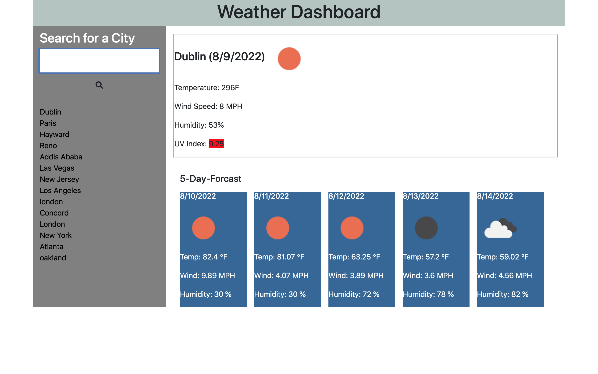

# Weather-Dashboard 

##Description

The purpose of this project is to develop a weather dashboard app that will be utilized by travelers. They will be able to search for a city and will be able to view the date, the name of the city and icon representation of current and 5 day weather forecast including temperature, humidity and wind-speed for that specific city.  The city will be added to the search history and will be stored in local-storage. 

## User Story

- AS A traveler
- I WANT to see the weather outlook for multiple cities
- SO THAT I can plan a trip accordingly

## Usage

This weather dashboard allows users to search for a city to get the current weather and 5 day forecast.
It will display the the city name, the date, an icon representation of weather conditions, the temperature, the humidity, the wind speed, and the UV index.
The UV index is color coded for favorable, moderate, or severe conditions.
Search history will be saved in local storage.
This weather app is mobile compatible.

## Technologies

- HTML
- JavaSript
- Bootstrap
- OpenWeather API

- [Github-link](https://github.com/meskyA/weather-dashboard)
- [Deployed-Link] (https://meskya.github.io/weather-dashboard/)
